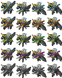

# Fire Emblem 3DS Sprite Splitter

## Overview
**Fire Emblem Fates** and **Fire Emblem Echoes**, in order to accomodate their class-changing systems,
store their map sprites in separate layers for the head and body. Each of these layers is further
divided into smaller components using a greyscale mask. As such, sprites ripped from these games appear
in a strange-looking format.
  
Of course, the games have their own method of putting all these images together internally, but since we
do not have access to **Nintendo's voodoo magic**, we have no choice but to composite them ourselves.
This script is intended for such compositing. All sprites used for testing were stolen without credit
from [The Spriters Resource](https://www.spriters-resource.com/3ds/fireemblemfates/).

## Dependencies
* **[Python](https://www.python.org/)** 3.4+
* **[OpenCV](https://opencv.org/)**
* **[NumPy](http://www.numpy.org/)**

## Example
### GUI settings

 

### Image output
Assembled images will be output to `outputs/caeldori_dark-falcon-f.png`. Sprite sheet will contain blue, red, green, and purple colored versions of the unit, as well as an auto-generated grayscale image.   

 
  Composited spritesheet  
